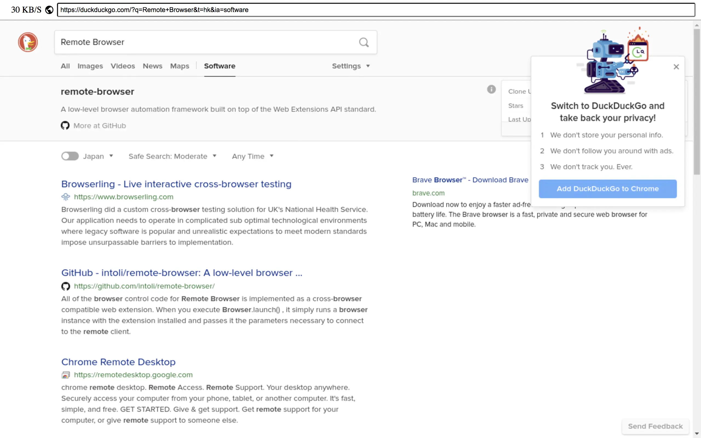

# Remote Browser

Using WebRTC to connect to puppeteer which running on remote server.

## Notice

This project is still under developing, open issue if you encounter any bug.

Following is known bug:

- Can not type non ASCII character, like Chinese or Japanese.
- Can not navigate to previous or next page.
- Can not scroll inside page element.
- Bad performance.

## Screenshot



## Installation

1. clone this repo `git clone https://github.com/bepsvpt-me/remote-browser.git`
2. run `chrome-dependencies-installer.sh` as root to install chrome dependencies(only test on Ubuntu 19.10)
3. run `yarn install` or `npm install` to install node dependencies
4. copy `.env.example` to `.env` and setup environment variables

## Start Server

Run following command to start server:

```shell
xvfb-run -a --server-args="-screen 0 1x1x24 -ac -nolisten tcp +extension RANDR" yarn serve
```

## Daemon

We have provide pm2 ecosystem config file, just follow commands below.

**start pm2 instance**

```shell
./node_modules/.bin/pm2 start ecosystem.config.js
```

**save process list**

```shell
./node_modules/.bin/pm2 save
```

**setup startup script**

```shell
./node_modules/.bin/pm2 startup
```

You can find more information from [pm2 document](https://pm2.keymetrics.io/docs/usage/startup/).

## Resources

- Puppeteer API - https://pptr.dev
- Chrome DevTools Protocol - https://chromedevtools.github.io/devtools-protocol/
- Chromium Command Line Switches - https://peter.sh/experiments/chromium-command-line-switches/
- WebRTC API - https://developer.mozilla.org/en-US/docs/Web/API/WebRTC_API
- SDP RFC - [rfc3264](https://tools.ietf.org/html/rfc3264), [rfc4566](https://tools.ietf.org/html/rfc4566)

## License

This project is licensed under [GNU Affero General Public License v3.0 only](LICENSE).
